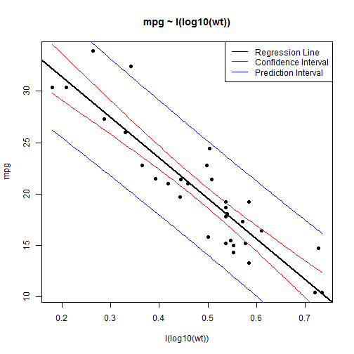

## mtcars Explorer Introduction

### Purpose
* mtcars Explorer is an interactive Shiny app  
* for studying the [mtcars dataset](https://stat.ethz.ch/R-manual/R-devel/library/datasets/html/mtcars.html)  
* enables exploration of individual variables for predicting mpg

### Obtaining the app
* The mtcars Explorer is deployed on [shinyapps.io](https://wilton2182.shinyapps.io/DevelopingDataProducts-ShinyApp).  
* The source code is available on [github](https://github.com/wilton2182/DevelopingDataProducts-ShinyApp).  

--- .class #id 

## Shiny App Overview

*Control* - The sidebar panel provides 3 controls that enable:

* Selection of one predictor variable,  
* Selection of one data transformation for the predictor variable,  
* Optional plotting of prediction and confidence interval lines.  

*Tabs* - The main window has tabs with output and help:
* Plot - scatterplot with regression line and intervals
* lm() Summary - provides linear regression model details
* Residual Analysis Plots - aid to finding data or model problems
* Help - general help on app usage

--- .class #id 

## Processing   

* Linear regression model uses predictor and transformation,  
* [lm()](https://stat.ethz.ch/R-manual/R-patched/library/stats/html/lm.html)
formula is of general form mpg ~ transform(predictor),  
* [predict.lm()](https://stat.ethz.ch/R-manual/R-patched/library/stats/html/predict.lm.html)
calculates prediction and confidence intervals,  
* [plot()](https://stat.ethz.ch/R-manual/R-devel/library/graphics/html/plot.html) 
generates a scatterplot of mpg vs. transformed predictor,
* [abline()](https://stat.ethz.ch/R-manual/R-devel/library/graphics/html/abline.html)
adds the regression line for the lm() model,  
* [matlines()](https://stat.ethz.ch/R-manual/R-devel/library/graphics/html/matplot.html)
adds prediction and confidence interval lines,  
* [summary.lm()](https://stat.ethz.ch/R-manual/R-patched/library/stats/html/summary.lm.html)
generates output on the lm() summary tab,  
* [plot.lm()](https://stat.ethz.ch/R-manual/R-patched/library/stats/html/plot.lm.html)
generates plots on the Residual Analysis Plots tab

--- .class #id 

## mtcars Plot Generated With R Code  

The plot below is generated with R code in this presentation as an example of
a plot displayed in the mtcars Explorer.

 

